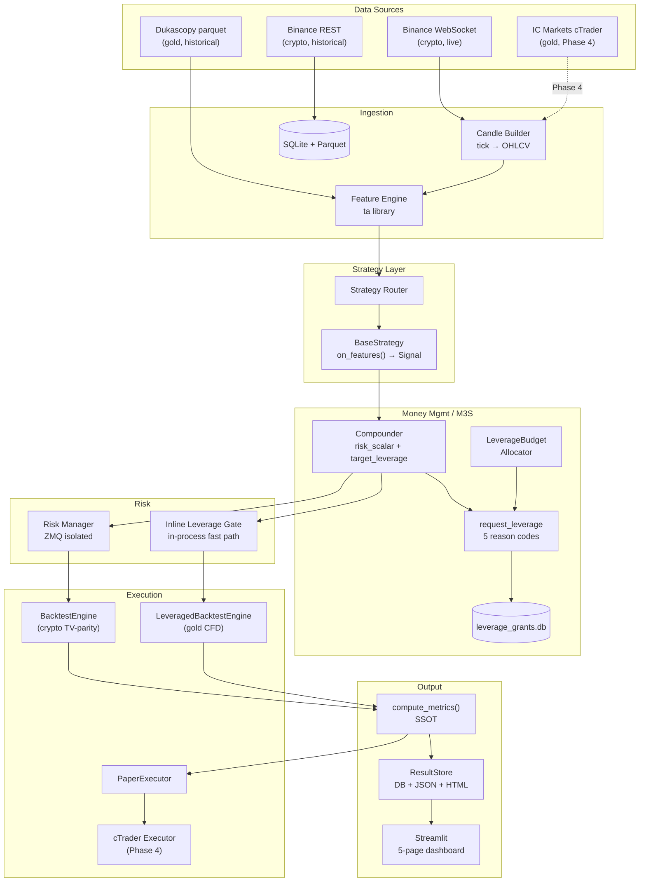
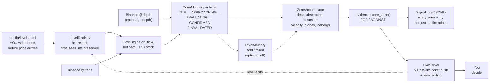
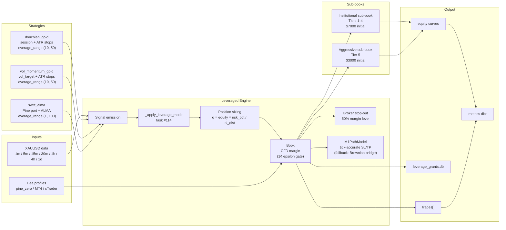
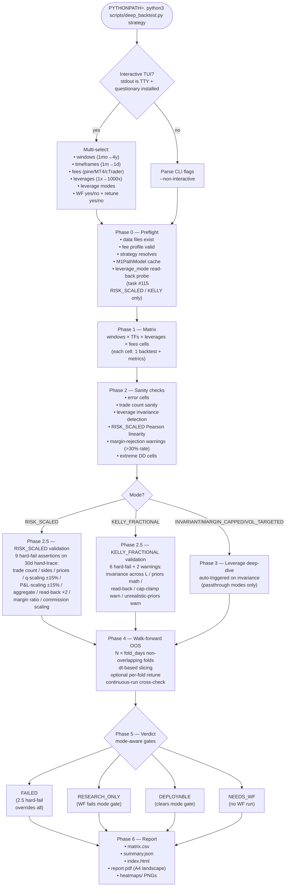
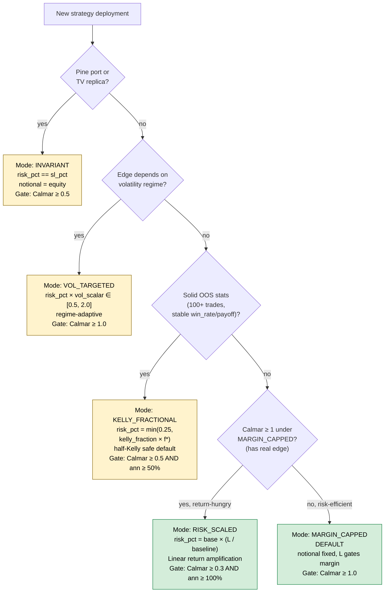
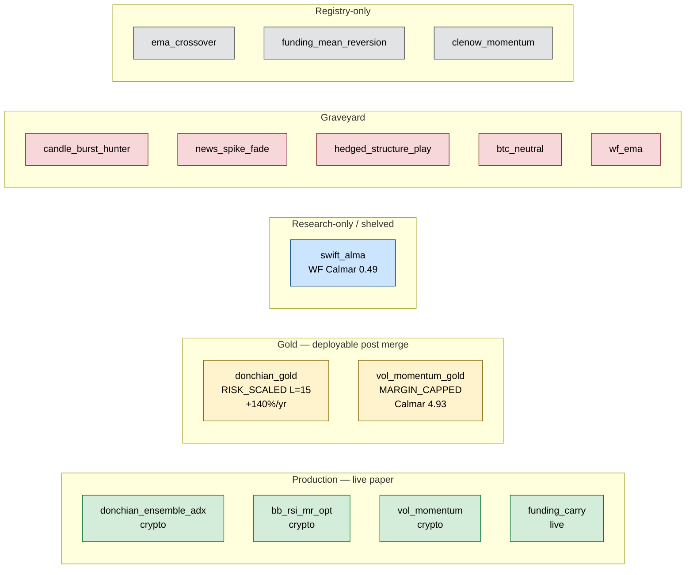
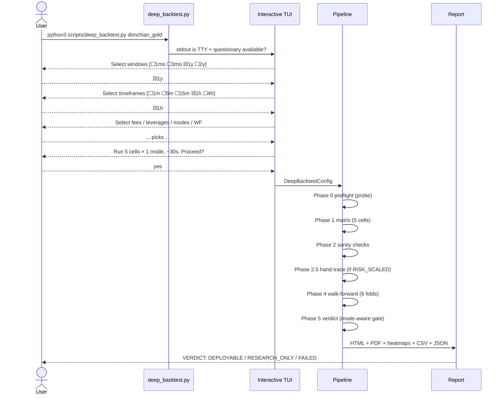
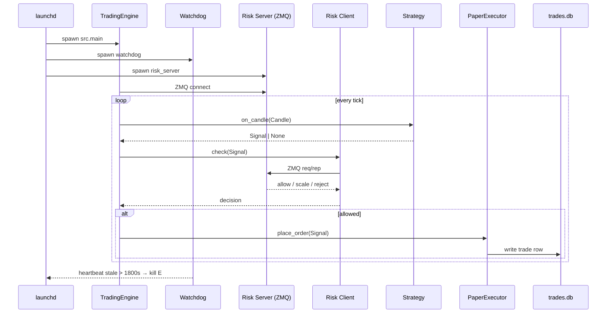
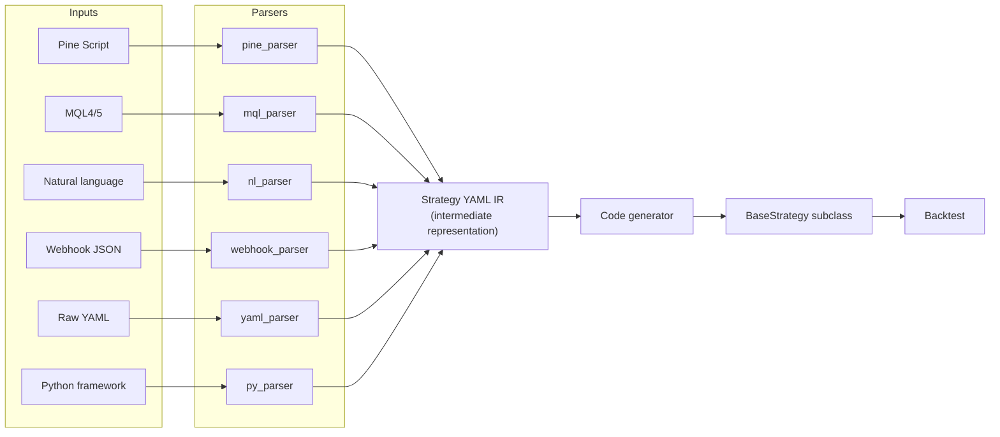

# Algo Trading System

A modular, event-driven algorithmic trading system for systematic trading at retail scale. Same `BaseStrategy.on_features() → Signal | None` code path in backtest and live. Risk management runs as a separate ZeroMQ process and cannot be bypassed.

**Phase status lives in [ROADMAP.md](ROADMAP.md) and only there.** This file is an onboarding doc: what the system is, how to run it, where things live. For what is in progress right now, read ROADMAP.md; for where the last session stopped, read [STATE.md](STATE.md).

**Validated production strategies (as of 2026-04-15 empirical validation):**

| Strategy | Mode | Deployment | Validated at | Verdict |
|---|---|---|---|---|
| `donchian_gold` | RISK_SCALED | L=15 (half-Kelly) | WF Calmar **+11.7**, ann return **+140%/yr** | ✅ DEPLOYABLE |
| `vol_momentum_gold` | MARGIN_CAPPED | L=10-15 | WF Calmar **+4.93**, 6/6 profitable folds | ✅ DEPLOYABLE |
| `swift_alma` | INVARIANT | — | WF continuous Calmar +0.488 | ❌ research-only |

---

## Project source of truth

Each concern lives in exactly one file. Redundancy causes drift.

| Concern | File |
|---|---|
| Phase status, milestones, next action | [ROADMAP.md](ROADMAP.md) |
| Current session + recent history | [STATE.md](STATE.md) |
| Historical sessions (8-17) | [SESSIONS_ARCHIVE.md](SESSIONS_ARCHIVE.md) |
| Live module registry + data flow + known gotchas | [ARCHITECTURE.md](ARCHITECTURE.md) |
| Decision rationale + research | [MASTER_PLAN.md](MASTER_PLAN.md) |
| Original v1.1 blueprint (frozen) | [BLUEPRINT.md](BLUEPRINT.md) |
| M3S detailed spec | [docs/M3S_SPEC.md](docs/M3S_SPEC.md) |
| Leverage strategy design principles | [docs/LEVERAGE_STRATEGY_DESIGN.md](docs/LEVERAGE_STRATEGY_DESIGN.md) |
| Broker fee profiles reference | [docs/BROKER_FEES.md](docs/BROKER_FEES.md) |
| 7-stage strategy dev process | [STRATEGY_DEVELOPMENT_PROCESS.md](STRATEGY_DEVELOPMENT_PROCESS.md) |
| Claude instructions + doc hygiene rules | [CLAUDE.md](CLAUDE.md) |

---

## Features

**Data & ingestion**
- Binance WebSocket live feed + historical REST downloader (crypto)
- Dukascopy parquet historical XAUUSD data (gold, 2y 1m/5m/1h)
- IC Markets cTrader Open API feed + OAuth helper (Phase 4, awaiting KYC)
- Event-driven candle builder with tick → OHLCV aggregation
- `ta`-library-based feature engine with 30+ indicators

**Strategies**
- 3 crypto-validated + 3 gold-validated + 7 registry-registered strategies
- Pluggable `BaseStrategy.on_features() → Signal | None` contract
- `leverage_range: tuple[float, float]` first-class metadata per strategy
- Strategy ingestion from Pine Script / MQL / natural language / webhooks / YAML / Python

**Backtest engines**
- Event-driven `BacktestEngine` (crypto, TradingView bit-exact parity)
- Separate `LeveragedBacktestEngine` for gold (CFD margin accounting, 50% broker stop-out, Brownian bridge + M1PathModel intrabar)
- 14 Plotly chart renderers, 7 validation protocols, tiered validation runner
- QuantStats integration, walk-forward optimizer
- Single-source-of-truth `compute_metrics()` for crypto; equivalent metrics dict for gold

**Deep Backtest framework** (task #112 + #114 + #115 + #79)
- Interactive `questionary` TUI for multi-select dimension picker
- 6-phase pipeline: preflight → matrix → sanity → leverage-validation → walk-forward → verdict → report
- 5 leverage modes: INVARIANT / MARGIN_CAPPED / VOL_TARGETED / RISK_SCALED / KELLY_FRACTIONAL
- Phase 0 read-back probe + Phase 2.5 zero-tolerance hand-trace validation
- **G.7 attribution** (task #79): per-cell decomposition of `return_pct` into alpha + leverage amplification + cost drag + margin rejection + residual
- HTML + landscape-A4 PDF + PNG heatmaps per run (HTML now includes Attribution section)
- Multi-mode dispatch: pick N modes, get N reports
- **Cross-run compare** CLI: `scripts/deep_backtest_compare.py` produces side-by-side HTML of 2+ runs with portfolio recommendation

**Risk management**
- ZeroMQ-isolated risk manager (out-of-process, cannot be bypassed)
- 4 adaptive modes: AGGRESSIVE / BALANCED / DEFENSIVE / CUSTOM
- Per-strategy profiles + mode backtest verification
- Leverage gates: per-position / aggregate / liquidation buffer
- Inline fast-path for leveraged engine (RCU versioned portfolio view)
- M3S `request_leverage` API with 5 reason codes + leverage_grants audit store

**Money management (M3S — Phase 3b-2)**
- `Compounder.risk_scalar` with geometric-mean blend + leverage damping at L > 1
- 10 sub-phases: regime detection, edge decay, purged CV, Bayesian Kelly, LeverageBudgetAllocator, HRP-lite allocator, meta-labeling (LR + LightGBM, shadow)
- Floor + Sharpe-weighted dynamic pool leverage allocation

**Order flow — research only, crypto only** (`src/data/cvd.py`, `src/data/order_book.py`, `src/flow/`)
- CVD: streaming `CVDCalculator` + vectorized `compute_delta_bars`, parity-tested against each other; divergence + absorption detection
- Free historical backfill from Binance Data Vision aggTrades archives (no order-book archive exists — books cannot be backfilled)
- Order book state machine with sequence-gap detection; a desynced book refuses to answer rather than drifting
- Depth recorder + liquidity heatmap (tick-aligned price bucketing)
- **Level-gated flow engine** (`src/flow/`): you write the levels, the engine measures flow when price reaches them and reports evidence FOR **and** AGAINST — absorption, the attack/defence sequence, tape velocity, large prints, exhausted retests, icebergs, and optional per-level memory of how prior tests resolved
- Levels are added and edited on the live page or in the TOML file — both write to the same file, so there is one place to look
- Live WebSocket operator page at 5 Hz (not Streamlit — a re-running script is too slow to watch price inside your level)
- Advisory only: emits `FlowSignal` objects, never orders. No execution path exists, by design
- **Not available on gold.** CFD ticks carry no size or aggressor, so CVD/footprint/delta are impossible on XAUUSD — real gold flow needs COMEX GC/MGC futures. See ARCHITECTURE.md Known Gotchas

**Live operations**
- Paper trading via launchd, watchdog with data-staleness detection
- Pre-flight checks, 5-step ramp plan, 30-day clock for G.3 paper validation
- Shadow orchestrator for ParquetReplayFeed → backtest parity verification
- Streamlit 5-page interactive dashboard

---

## Quick start

```bash
# Install dependencies
pip install -r requirements.txt
pip install questionary  # optional, enables deep_backtest interactive TUI

# Crypto backtest (produces SQLite row + JSON + HTML)
python3 -m scripts.backtest run bb_rsi_mr --symbol BTCUSDT --tf 1h --days 365

# Deep backtest a strategy (interactive multi-select TUI)
PYTHONPATH=. python3 scripts/deep_backtest.py donchian_gold

# Deep backtest non-interactive with RISK_SCALED mode
PYTHONPATH=. python3 scripts/deep_backtest.py donchian_gold \
  --non-interactive \
  --timeframes 1h --windows 365 --leverages 10,15,20 \
  --fees ic_markets_mt4_xauusd_normal \
  --leverage-mode risk_scaled --baseline-leverage 10

# Validate strategy across multiple intervals
python3 -m scripts.backtest validate bb_rsi_mr --tier lite

# Import a strategy from Pine Script / MQL / natural language
python3 -m scripts.import_strategy import --format natural \
  --describe "Buy when 9 EMA crosses 21 EMA"

# Launch interactive dashboard
python3 -m scripts.dashboard

# Run live pipeline
python3 -m src.main
```

**Order flow (research, crypto only):**

```bash
# CVD from free Binance archives, into delta bars
python3 -m scripts.cvd backfill --symbol BTCUSDT --tf 5m --days 30

# Record order book depth for the liquidity heatmap
python3 -m scripts.depth record --symbol BTCUSDT --minutes 60

# Level-gated flow monitor — write your levels first, then watch them
cp config/levels.example.toml config/levels.toml   # then edit it
python3 -m scripts.flow_monitor --symbol BTCUSDT --depth
#   --level-memory   remember how each level resolved before (off by default)
#   --no-turn        fire on score alone instead of requiring the turn
# UI: http://127.0.0.1:8760
```

`config/levels.toml` is gitignored — your levels are yours. You can edit it by hand
(the monitor hot-reloads it every 10 s) or add and edit levels directly on the page,
which writes through to the same file. Threshold, require-turn and level memory are
live controls; `--depth` is the one setting that still needs a restart, because
toggling it means resubscribing the feed.

---

## Architecture — system overview



---

## Architecture — level-gated flow (advisory)

Deliberately drawn separately from the diagram above: this path has **no edge into
execution**, and joining the two graphs would imply one exists. A human writes the
levels; the engine only answers *what is flow doing now that price is here*.



Three deliberate constraints:

- **The log records a null-hypothesis baseline for every zone entry**, not just the
  confirmations. Without that, "does the scorer beat simply taking the level?" is
  unanswerable, and a scorer that cannot be shown to beat the baseline is decoration.
- **Not backtestable, by design.** Level selection on historical data is
  hindsight-contaminated — you already know which levels held. Evaluation is
  forward-only: shadow-run it, collect outcomes, then judge.
- **`first_seen_ms` is stamped on first load and preserved across reloads.** It is the
  only thing separating a level written *before* price arrived from one written after.

---

## Architecture — Gold Leveraged Stack



---

## Deep Backtest pipeline (task #112 + #114 + #115 + #79)



---

## Leverage modes — decision flowchart (task #113 research + #114 implementation)



**Strategy → mode assignment (empirically validated 2026-04-15):**

| Strategy | Mode | Why | Source |
|---|---|---|---|
| `swift_alma` | INVARIANT | Pine port, fold-3 chop regime kills scaling | Task #111 WF fail |
| `donchian_gold` | RISK_SCALED L=15 | **Return-hungry, high-edge** — 5/6 profitable folds, +140%/yr | Task #115 validation ✅ |
| `vol_momentum_gold` | MARGIN_CAPPED L=10-15 | **Risk-efficient, low-return** — Calmar 4.93 but only 24%/yr under RISK_SCALED | Task #114 + #115 ✅ |

---

## Strategy status



**Detailed status:**

| Strategy | Location | Status | Best backtest metric | Notes |
|---|---|---|---|---|
| `donchian_gold` | `src/strategies/trend_following/donchian_gold.py` | ✅ DEPLOYABLE | WF Calmar +11.7 / +140%/yr at L=15 RISK_SCALED | Task #115 empirically validated |
| `vol_momentum_gold` | `src/strategies/momentum/vol_momentum_gold.py` | ✅ DEPLOYABLE | WF Calmar +4.93 at L=10 MARGIN_CAPPED | Diversifier role |
| `swift_alma` | `src/strategies/trend_following/swift_alma.py` | 🔬 Research-only | 1y Calmar +2.14, WF continuous Calmar +0.49 | Pine port, fold-3 regime dependency |
| `donchian_ensemble_adx` | `src/strategies/trend_following/donchian_ensemble.py` | ✅ Live paper | Sharpe 2.32 crypto baseline | Portfolio 30% |
| `bb_rsi_mr_opt` | `src/strategies/day_trading/bb_rsi_mr.py` | ✅ Live paper | — | Portfolio 40% |
| `vol_momentum` | `src/strategies/momentum/vol_momentum.py` | ✅ Live paper | — | Portfolio 30% (crypto) |
| `funding_carry` | `src/strategies/carry/funding_carry.py` | ✅ Live paper | — | Funding-rate capture |
| `candle_burst_hunter` | `src/strategies/aggressive/candle_burst_hunter.py` | ⚰️ Graveyard | — | Needs tick data fundamentally |
| `news_spike_fade` | `src/strategies/aggressive/news_spike_fade.py` | ⚰️ Graveyard | — | Bar-level can't capture tick fade |
| `hedged_structure_play` | `src/strategies/aggressive/hedged_structure_play.py` | ⚰️ Graveyard | — | Design mismatch with gold trend |
| `ema_crossover` | `src/strategies/scalping/ema_crossover.py` | 📋 Registry | — | Not yet validated |
| `funding_mean_reversion` | `src/strategies/carry/funding_mean_reversion.py` | 📋 Registry | — | Not yet validated |
| `clenow_momentum` | `src/strategies/momentum/clenow_momentum.py` | 📋 Registry | — | Not yet validated |

---

## Workflow — deep backtest (interactive)



---

## Workflow — live trading (paper, main branch)



---

## Strategy ingestion pipeline



---

## Directory structure

```
algo-trading/
├── src/
│   ├── main.py                           # TradingEngine entry point
│   ├── config.py                         # TOML config loader (msgspec)
│   ├── shadow_orchestrator.py            # ParquetReplayFeed driver (G.2h.2)
│   ├── data/
│   │   ├── feeds/binance_ws.py           # Binance WebSocket feed
│   │   ├── feeds/icmarkets_feed.py       # IC Markets cTrader Open API (Phase 4)
│   │   ├── feeds/parquet_replay_feed.py  # Historical replay as async feed
│   │   ├── candle_builder.py             # Tick → OHLCV
│   │   ├── feature_engine.py             # Technical indicators (ta library)
│   │   ├── storage.py                    # SQLite + Parquet storage
│   │   ├── downloader.py                 # Historical data downloader
│   │   ├── cvd.py                        # Cumulative Volume Delta (crypto research)
│   │   ├── agg_trades.py                 # Binance Data Vision aggTrades backfill
│   │   ├── order_book.py                 # Order book state + desync detection
│   │   └── depth_recorder.py             # Depth sampling + heatmap grid
│   ├── flow/                             # Level-gated order flow (advisory, crypto)
│   │   ├── level_registry.py             # TOML levels, hot-reload, first_seen_ms
│   │   ├── features.py                   # ZoneAccumulator — the hot path
│   │   ├── evidence.py                   # Rule-based scorer, FOR and AGAINST
│   │   ├── zone_state.py                 # ZoneMonitor state machine + FlowEngine
│   │   ├── level_memory.py               # Prior held/failed outcomes (optional, off)
│   │   ├── signal_log.py                 # JSONL signals + null-hypothesis baselines
│   │   ├── live_server.py                # WebSocket push, 5 Hz
│   │   └── live_page.html                # Operator page (static, pushed to)
│   ├── strategies/
│   │   ├── base.py                       # BaseStrategy interface + leverage_range
│   │   ├── router.py                     # StrategyRouter + STRATEGY_REGISTRY
│   │   ├── trend_following/
│   │   │   ├── donchian_ensemble.py      # Crypto Donchian (TV-parity)
│   │   │   ├── donchian_gold.py          # Gold Donchian + session filter
│   │   │   └── swift_alma.py             # Pine SWIFTALGO port
│   │   ├── day_trading/bb_rsi_mr.py      # BB+RSI Mean Reversion (crypto)
│   │   ├── momentum/vol_momentum.py      # Crypto momentum
│   │   ├── momentum/vol_momentum_gold.py # Gold vol-targeted momentum
│   │   ├── momentum/clenow_momentum.py   # Clenow trend (registry)
│   │   ├── carry/funding_carry.py        # Funding carry (live)
│   │   ├── carry/funding_mean_reversion.py # Funding MR (registry)
│   │   ├── scalping/ema_crossover.py     # EMA scalp (registry)
│   │   └── aggressive/                   # Tier 5 (graveyard)
│   │       ├── candle_burst_hunter.py
│   │       ├── news_spike_fade.py
│   │       └── hedged_structure_play.py
│   ├── backtest/
│   │   ├── engine.py                     # Event-driven crypto engine (TV-parity)
│   │   ├── leveraged_engine.py           # Gold CFD engine (G.2a.4)
│   │   ├── book.py                       # LeveragedPosition + Book + stop-out (G.2a)
│   │   ├── costs.py                      # IC Markets spread + commission (G.2a.2)
│   │   ├── fee_profiles.py               # Named broker fee profiles (task #106)
│   │   ├── path.py                       # Brownian bridge + M1PathModel (G.2a.3/G.5b)
│   │   ├── structure_levels.py           # PDH/PDL, Fib, swing H/L (G.2e)
│   │   ├── deep_backtest.py              # Generic pipeline (tasks #112/#114/#115/#79)
│   │   ├── deep_backtest_interactive.py  # questionary TUI (task #114)
│   │   ├── deep_backtest_report.py       # HTML + PDF + heatmap + attribution (task #79)
│   │   ├── metrics.py                    # compute_metrics() SSOT
│   │   ├── result_store.py               # Triple output (DB + JSON + HTML)
│   │   ├── charts.py                     # 14 Plotly renderers
│   │   ├── report.py                     # Jinja2 HTML report
│   │   ├── protocols.py                  # 7 test protocols
│   │   ├── validator.py                  # Tiered validation (lite→research)
│   │   ├── walk_forward.py               # Walk-forward optimizer
│   │   └── quantstats_bridge.py          # QuantStats tearsheets
│   ├── m3s/                              # Master Money Management System (Phase 3b-2)
│   │   ├── compounder.py                 # risk_scalar + leverage damping (G.2b)
│   │   ├── hooks.py                      # request_leverage facade (G.2b)
│   │   ├── leverage_grants.py            # SQLite append store (G.2b)
│   │   ├── leverage_budget.py            # Floor + Sharpe-weighted allocator (G.2h.4)
│   │   ├── aggressive_compounder.py      # Tier 5 fixed-% (G.2e)
│   │   ├── portfolio_view.py             # RCU versioned snapshot (G.2c)
│   │   ├── allocator.py                  # HRP-lite + Ledoit-Wolf
│   │   ├── portfolio.py                  # PortfolioTracker + rolling stats
│   │   ├── regime.py                     # Regime detection + mode switching
│   │   ├── evaluation.py                 # Purged CV + Bayesian Kelly
│   │   ├── edge_decay.py                 # Strategy edge-decay detection
│   │   └── signal_filter/                # Phase 3c meta-labeling (LightGBM + LR)
│   ├── risk/
│   │   ├── manager.py                    # 7-check chain + mode resolution
│   │   ├── server.py / client.py         # ZeroMQ transport
│   │   ├── kelly_sizer.py
│   │   ├── circuit_breakers.py
│   │   ├── kill_switch.py
│   │   ├── fat_finger.py
│   │   └── inline_leverage.py            # In-process fast path (G.2c)
│   ├── research/
│   │   ├── strategy_ir.py                # Strategy YAML IR schema
│   │   ├── codegen.py                    # IR → Python codegen
│   │   ├── catalog.py                    # Strategy catalog
│   │   └── parsers/                      # 6 format parsers
│   ├── execution/
│   │   ├── base.py                       # Executor interface
│   │   ├── paper_executor.py             # Paper trading
│   │   └── icmarkets_executor.py         # cTrader executor (Phase 4)
│   ├── utils/
│   │   ├── types.py                      # Signal, Fill, LeverageGrant
│   │   ├── instruments.py                # XAUUSD metadata (G.0b)
│   │   ├── config.py                     # TOML loader (msgspec)
│   │   └── logger.py                     # structlog setup
│   └── dashboard/app.py                  # Streamlit 5-page dashboard
├── scripts/
│   ├── backtest.py                       # Unified crypto backtest CLI
│   ├── deep_backtest.py                  # Deep backtest CLI (tasks #112/#114)
│   ├── deep_backtest_compare.py          # Cross-run side-by-side compare CLI (task #79)
│   ├── walk_forward_donchian_gold.py     # Bespoke WF (task #86)
│   ├── walk_forward_vol_momentum_gold.py # Bespoke WF (task #90)
│   ├── walk_forward_swift_alma.py        # Bespoke WF (task #111)
│   ├── swift_full_matrix.py              # SWIFT 240-cell matrix (task #109)
│   ├── import_strategy.py                # Multi-format strategy import CLI
│   ├── cvd.py                            # CVD backfill + delta bars CLI
│   ├── depth.py                          # Depth recorder CLI
│   ├── flow_monitor.py                   # Level-gated flow monitor + live UI
│   ├── dashboard.py                      # Streamlit launcher
│   ├── run_verification.py               # Engine verification suite
│   ├── g3_preflight.py                   # Pre-flight for G.3 paper clock
│   ├── watchdog.py                       # Engine heartbeat + kill
│   └── preflight.py                      # Pre-paper-launch checks
├── config/
│   ├── settings.toml                     # Main + [m3s_gold] gold bucket
│   ├── strategies.toml                   # Strategy parameters
│   ├── risk.toml                         # Risk dials + [leverage] gates
│   ├── broker_fees.toml                  # Fee profile registry (task #106)
│   ├── news_calendar.csv                 # NFP/FOMC/CPI windows
│   ├── levels.example.toml               # Flow levels template (levels.toml gitignored)
│   └── report_template.html              # Jinja2 HTML template
├── tests/                                # pytest suite mirroring src/ (see STATE.md for counts)
├── docs/
│   ├── LEVERAGE_STRATEGY_DESIGN.md       # Leverage mode design principles
│   ├── BROKER_FEES.md                    # Fee schedule research
│   └── M3S_SPEC.md                       # M3S phase spec
├── reports/                              # Generated backtest reports (gitignored)
├── research/                             # Research documents
├── alpaca/                               # Alpaca MCP server (US equities)
├── tradingview-mcp-jackson/              # TradingView MCP server
├── STRATEGY_DEVELOPMENT_PROCESS.md       # 7-stage strategy dev flow
├── ARCHITECTURE.md                       # Live module registry + gotchas
├── STATE.md                              # Session continuity tracker
├── ROADMAP.md                            # Phase status (single source of truth)
├── MASTER_PLAN.md                        # Full project context
└── CLAUDE.md                             # Claude instructions + doc hygiene
```

---

## MCP servers

Both servers are registered in `~/.claude.json` under `mcpServers`. Claude picks them up on startup.

| Server | Config key | Entry point | Purpose |
|---|---|---|---|
| Alpaca | `"alpaca"` | `alpaca/server.js` | Place/manage trades on Alpaca paper/live |
| TradingView | `"tradingview"` | `tradingview-mcp-jackson/src/server.js` | Read charts, indicators, Pine Script (78 tools) |

**Alpaca tools:** `get_account`, `place_order`, `get_positions`, `close_position`, `get_orders`, `cancel_order`, `get_quote`.

**TradingView tool categories:** chart state / data extraction / Pine Script editing / drawings / alerts / symbol + layout control / replay / batch-run / UI automation.

---

## Tech stack

| Layer | Technology |
|---|---|
| Language | Python 3.11 |
| Data classes | msgspec |
| Logging | structlog |
| Indicators | `ta` library (NOT pandas-ta) |
| ML | scikit-learn (LR) + LightGBM (meta-labeling shadow) |
| Storage | SQLite + Parquet |
| Charts | Plotly |
| Reports | Jinja2 HTML + fpdf2 PDF |
| TUI | questionary (deep_backtest interactive) |
| Dashboard | Streamlit |
| Market data (crypto) | Binance WebSocket + REST |
| Market data (gold) | Dukascopy parquet + IC Markets cTrader (Phase 4) |
| Config | TOML |
| Transport (risk) | ZeroMQ |
| Transport (flow UI) | `websockets` + orjson, uvloop on the hot path |

---

## Tested & proven

**Test suite:** the live total moves every session — see [STATE.md](STATE.md). Notable blocks:

- 207 order-flow tests (`tests/test_flow/`) — state machine, evidence rules, iceberg
  discriminator pinned in both directions, level memory
- 50 deep_backtest framework tests (task #112 + #114 + #115 + #79)
- 43 strategy storage tests (task #117 + #118-#130 follow-up sweep)
- 46 swift_alma_v2 tests (task #131 mode-aware sizing + task #132 ladder/reversal port)
- 7 leverage invariance tests (task #110)
- 20 TV parity tests (task #104)
- 11 M3S leverage tests (task #67)
- 27 Brownian bridge + M1PathModel tests (G.2a.3 + G.5b)
- 32 CFD Book margin tests (G.2a)
- 20 IC Markets cost model tests (G.2a.2)
- ~1065 other unit + integration tests

**Live operations:** paper trading deployed via launchd on `main`. Watchdog with data-staleness detection (task #97). M3S + meta-labeling in shadow mode (Phase 3b-2, Phase 3c). Pre-flight checks (task #89).

**Empirically validated gold deployments** (task #115, 2026-04-15):
- `donchian_gold` at RISK_SCALED L=15 → **WF continuous Calmar +11.7, +140%/yr annualized**, 5/6 profitable folds
- `vol_momentum_gold` at MARGIN_CAPPED L=10 → WF continuous Calmar +4.93, 6/6 profitable folds (from task #114 cross-validation)
- `swift_alma` → research-only (fold-3 chop regime kills scaling, WF Calmar +0.49)

---

## Roadmap

See [ROADMAP.md](ROADMAP.md) — it is the authoritative and only phase table. This file
does not restate it, because two copies of a status is one copy too many.

For where the last session stopped and what it was in the middle of, see
[STATE.md](STATE.md).

---

*Onboarding doc. Refreshed when a phase completes, when a new top-level component lands
in `src/`, or when the description above drifts from what the code does — not per task.
Last refresh: 2026-09-22 (order-flow stack + level-gated flow engine documented).*
